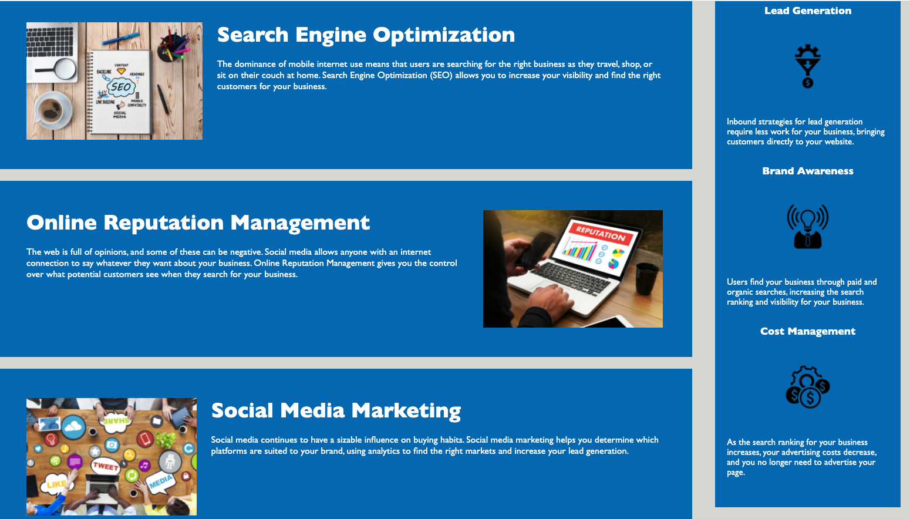

Lori Timmons
Week 1: HTML CSS Git Challenge: Code Refactor

Project Description:
After review of the existing code structure, I was able to improve many aspects of the html and CSS syntax. I made changes to the readability of the code by adding semantic elements, updated format / order of both CSS and html files and removed unnecessary code lines. Reviewed the site's accessibility status and made updates to ensure the website is accessible to all users. Accessibility was improved by adding alt text to all images, fixing broken links and improving contrast of text vs background. I also added a meta to help improve SEO. 

Links: 
URL to deployed application: https://loritimmons.github.io/homeworkweek1/
The URL of the GitHub repository: https://github.com/LoriTimmons/homeworkweek1